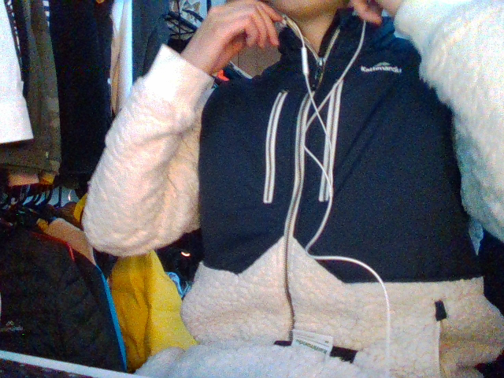
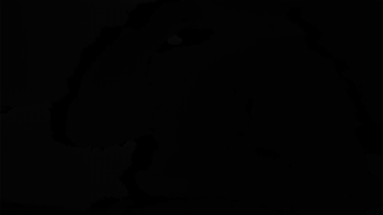
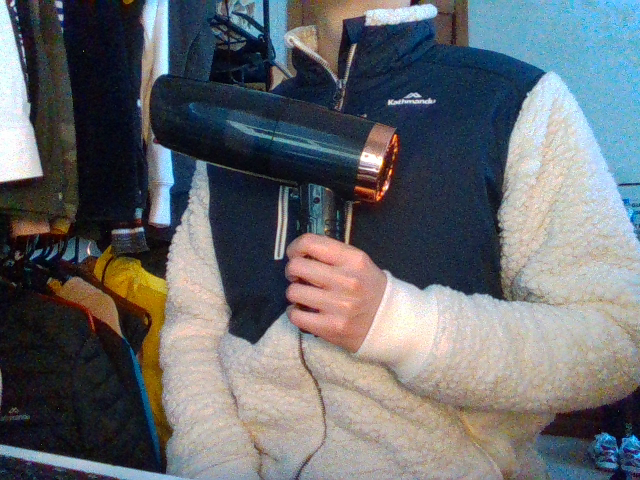
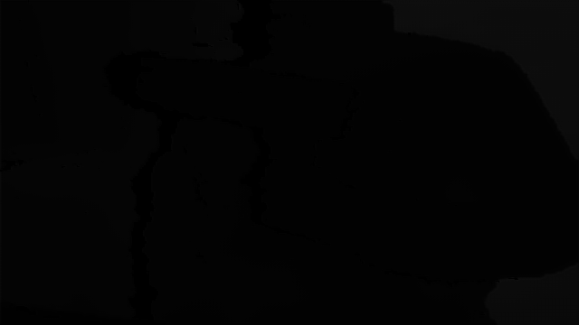
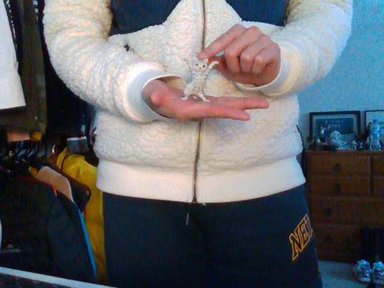
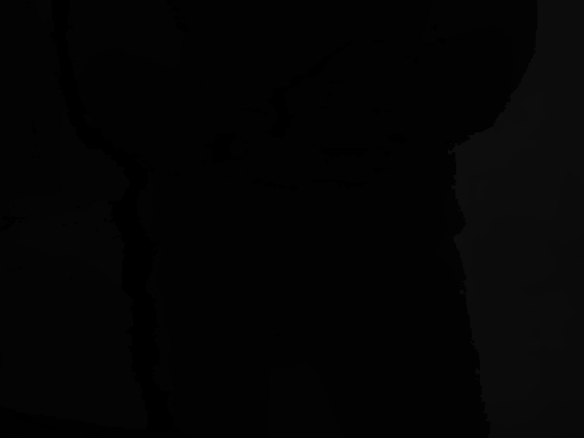
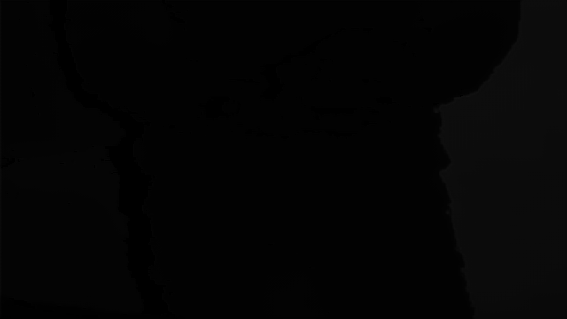

# ROS-dndb-node
This is a ROS node project which is obtained a denoised & deblurred (DNDB) model to work on the depth map (DM). It subscribes topics from a Intel® RealSense™ D435/D435i camera to get the real-time video, depth value, and points cloud, and publishes the 640 x 360 DNDB depth map on the topic called "DNDB_depth".
 
 
| RGB | Original DM | DNDB DM |
|     :---:    |     :---:      |     :---:     |
|      |        |       |
|      |        |       |
|      |        |       |

## Usage

**Requirements/Dependencies**

- Linux or macOS
- Python ≥ 3.6
- PyTorch ≥ 1.3
- [torchvision](https://github.com/pytorch/vision/) that matches the PyTorch installation.
	You can install them together at [pytorch.org](https://pytorch.org) to make sure of this.
  Please ensure that your version of CUDA is also compatible when installing.
- OpenCV `pip install opencv-python`
- PyRealSense `pip install pyrealsense2`
- ROS Kinetic/Melodic
- [Intel RealSense ROS wrapper](https://github.com/IntelRealSense/realsense-ros)
- [Catkin](www.ros.org/wiki/catkin#Installing_catkin)
- gcc & g++ ≥ 4.9

**My Environment**

- Ubuntu 18.04.5 LTS
- ROS Melodic
- Python 3.7.11
- PyTorch 1.6.0 (cpu only)
- Torchvision 0.7.0

**After Installation**
* Clone the git repository as the ROS package
* [Create a catkin workspace](http://wiki.ros.org/catkin/Tutorials/create_a_workspace) and move the cloned directory in the source folder (your_catkin_ws/src)
* Ensure ros_dndb_node.py is executable. Type `chmod +x ~/your_catkin_ws/src/ROS-dndb-node/ros_dndb_node.py`
* To perform depth denoise & deblur manipulation straight from a D435/D435i camera attached to a USB port:
  * Type `roslaunch realsense2_camera rs_d400_and_t265.launch`
  * In a new terminal window, go to your ROS work space, type 
    `catkin_make` 
    `source devel/setup.bash` 
    `rosrun ROS-dndb-node ros_dndb_node.py`
  * If there are any complications, make sure the topic this node is subscribed to has the same name. Type `rostopic list` to see current topics published
* To find the published depth map, in a new terminal type `rostopic echo /DNDB_depth` or find both retrieved and published imges/depth map in your directory `your_katkin_ws/src/ROS-dndb-node/exampes`
* Press `Ctrl + c` or `Ctrl + z` to stop
